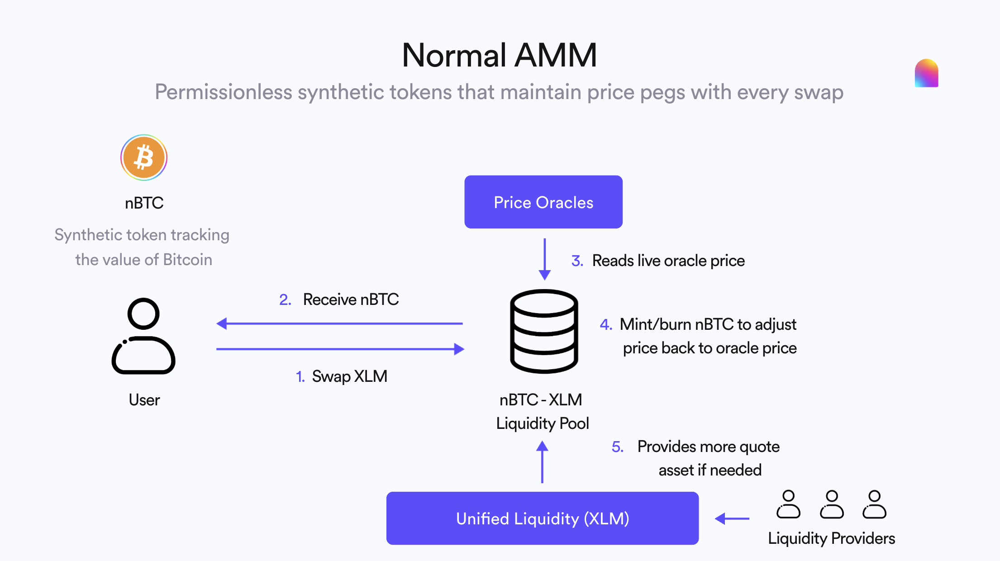

  

  
  
  
  
  
  
  
  

# ✨ Normal Stellar v1 🦄

Normal is a synthetic asset protocol enabling investors to trade any crypto asset or real-world asset (RWA) from a single DEX.

## Features

- Buy and sell any Top 100 crypto from a single DEX on Stellar using Normal Tokens (i.e. nBTC - Normal Bitcoin)
- Earn yield by providing XLM as liquidity to Normal Token pools
- Stake and earn yield from the Insurance Fund by helping cover liquidity deficits
- Earn reward tokens by using the Normal Protocol to swap and provide liquidity

## Smart Contracts

- **pool** - A constant product AMM for synthetic assets that automatically mints/burns the synthetic asset to maintain an oracle price peg
- **pool_router** - entry point and catalogue of liquidity pools which is capable to deploy new pools if necessary
- **insurance_fund** - Additional backstop for liquidity deficits. Funded via liquidity provider staking deposits
- **oracle_registry** - Oracle aggegation and price validation making it easier for pools to source reliable oracle prices
- **pool_plane** - contract designed to store minimum information about any pool: type, parameters, reserves. being updated on every action with the pool (deposit, swap, withdraw, parameters update, etc)
- **liquidity_calculator** - smart contract containing pools liquidity calculation logic which is capable to compare many pools at once
- **lp_token** - [SEP-0041](https://github.com/stellar/stellar-protocol/blob/master/ecosystem/sep-0041.md) compatible token smart contract designed for liquidity pool share management
- **token** - [SEP-0041](https://github.com/stellar/stellar-protocol/blob/master/ecosystem/sep-0041.md) compatible token smart contract

## Modules

- **access_control** - Handles permissioned access to contracts using role-based access control (RBAC)
- **incentives** - Handles how liquidity provider fees and pool rewards are calculated and claimed
- **reentrancy_guard** - Handles utilities helping prevent re-entrant calls (even though they're technically impossible on Soroban)
- **token_lp** - Handles LP token utilities
- **token_synthetic** - Handles synthetic token (`Pool.token_a`) utilities
- **upgrade** - Handles contract upgrades
- **utils** - Handles shared types, utils, constants, errors, macros, and more

## Built With

- [Rust](https://www.rust-lang.org/)
- [Soroban](https://soroban.stellar.org/)
- [Rust Soroban SDK](https://github.com/stellar/rs-soroban-sdk)

## Deployment

- Register a XLM oracle: `yarn oracle:register <identity> testnet XLM 14 1`
- Register a BTC oracle: `yarn oracle:register <identity> testnet BTC 14 1`
- Deploy a nBTC/XLM pool: `yarn pool:deploy <identity> testnet BTC nBTC 30 A 1_000_000_0000000`
- Deposit liquidity to the pool: `yarn pool:deposit <identity> testnet BTC 10_0000000`
- Withdraw liquidity to the pool: `yarn pool:withdraw <identity> testnet BTC 5_0000000`
- Swap: `yarn pool:swap <identity> testnet BTC Buy 1_0000000 <out_min>`

## Getting Started

### Prerequisites

- [Task](https://taskfile.dev/) as task runner
- installed latest Rust version
- [soroban cli](https://github.com/stellar/soroban-tools)

### Development setup

#### Clone project

`git clone git@github.com:normalfinance/normal-stellar-amm.git`

#### Build contracts

`task build`

#### Run tests

`task test`

#### (Optionally) Deploy & invoke contracts via soroban-cli

check the Soroban documentation: https://soroban.stellar.org/docs/reference/rpc

## Authors

- [@AquaToken](https://github.com/AquaToken)
- [@jblewnormal](https://github.com/jblewnormal)
- [@jaymalve](ttps://github.com/jaymalve)

## Contributing

Contributions are what make the open source community such an amazing place to learn, inspire, and create. Any contributions you make are **greatly appreciated**.

If you have a suggestion that would make this better, please fork the repo and create a pull request. You can also simply open an issue with the tag "enhancement".
Don't forget to give the project a star! Thanks again!

1. Fork the Project
2. Create your Feature Branch (`git checkout -b feature/AmazingFeature`)
3. Commit your Changes (`git commit -m 'Add some AmazingFeature'`)
4. Push to the Branch (`git push origin feature/AmazingFeature`)
5. Open a Pull Request

## Audits

You can find audits of this codebase in the `/audits` directory. These are our most recent audits:

- **Summer 2025 x Halborn** - (https://github.com/normalfinance/normal-stellar-amm/audits/)

## Contact

- 📧 Email: [hello@normalfinance.io](mailto:hello@normalfinance.io)
- ✈️ Telegram: [@normalfinance](https://t.me/normalfinance)
- 🐣 Twitter: [@normalfi](https://twitter.com/normalfi)
- 🥷🏼 GitHub: [@normalfinance](https://github.com/normalfinance)
- 👾 Discord: [@Normal](https://discord.gg/cB3DVSddQR)
- 📚 Docs: [@normalfinance](https://docs.normalfinance.io/)
- 🤓 Blog: [@normalfinance](https://blog.normalfinance.io/)

## License

[Apache-2.0](https://choosealicense.com/licenses/apache-2.0/)
